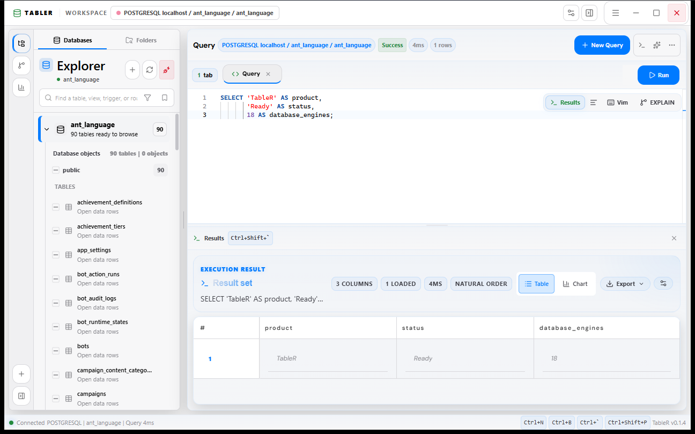
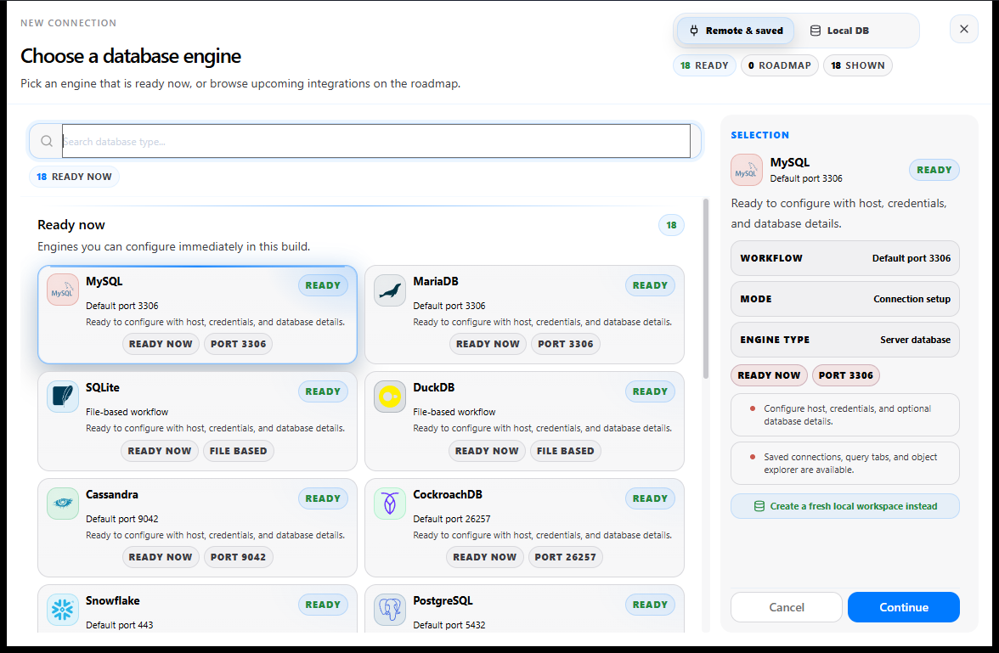
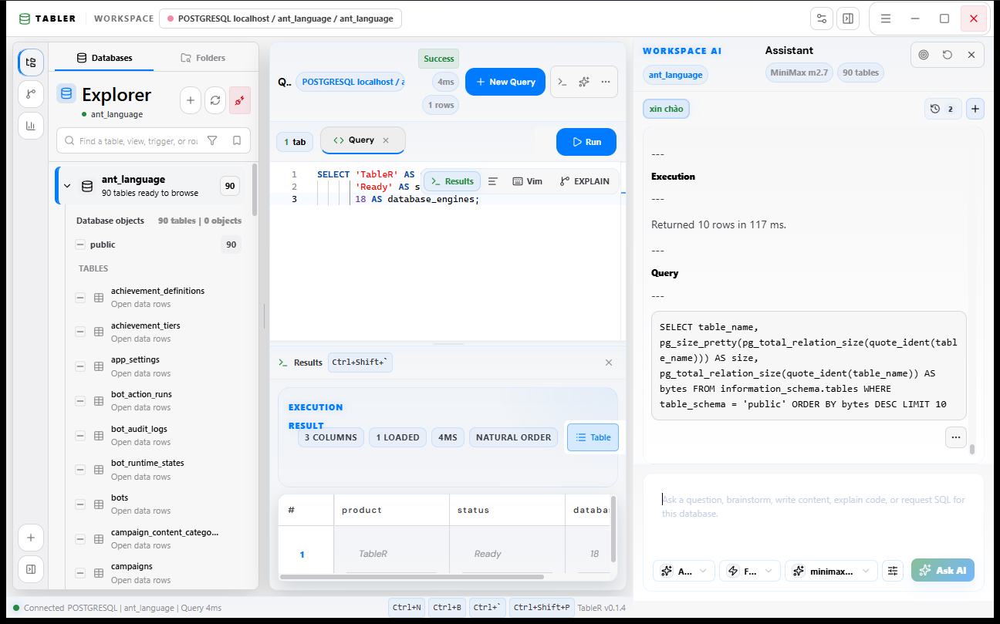
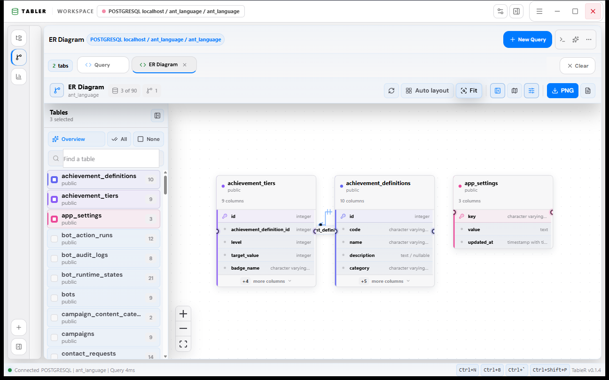

<p align="center">
  
</p>

<h1 align="center">TableR</h1>

<p align="center">
  A fast, cross-platform database workspace for exploring schemas, writing SQL,
  visualizing results, and working with AI.
</p>

<p align="center">
  <a href="https://github.com/minhe51805/TabLer/releases">
    
  </a>
  <a href="LICENSE">
    
  </a>
  <a href="https://tauri.app">
    
  </a>
  <a href="https://react.dev">
    
  </a>
  <a href="https://www.rust-lang.org">
    
  </a>
</p>

<p align="center">
  <a href="https://github.com/minhe51805/TabLer/releases">Releases</a>
  &middot;
  <a href="https://github.com/minhe51805/TabLer/issues">Report an issue</a>
  &middot;
  <a href="https://github.com/minhe51805/TabLer/discussions">Discussions</a>
</p>



TableR brings the tools used during day-to-day database work into one native
desktop application. Browse database objects, write and run SQL in Monaco,
inspect or export results, build charts and ER diagrams, and use a
database-aware AI workspace without switching applications.

## Highlights

| Area | What TableR provides |
| --- | --- |
| SQL workspace | Monaco editor, multiple query tabs, formatting, execution timing, explain tools, history, and favorites |
| Data exploration | Searchable schema explorer, table data browsing, row inspection, pagination, sorting, and filtering |
| Results and exports | Table and chart views with CSV, JSON, Excel, and SQL-oriented export workflows |
| Visual database tools | Interactive ER diagrams, minimap and layout controls, metrics boards, and query plan visualization |
| AI assistance | Prompt, edit, and agent workflows with database context and configurable model providers |
| Desktop workflow | Saved connections, local database bootstrap, secure credential handling, command palette, terminal, and session persistence |

## Product Tour

### Connection launcher

Choose from remote, saved, file-based, or locally bootstrapped database
workspaces. The launcher exposes engine capabilities before opening the
connection form.



### AI workspace

Keep schema context, generated SQL, query execution, and the assistant visible
in the same workspace.



### ER diagrams

Select only the tables you need, automatically arrange them, inspect
relationships, fit the canvas, and export the result.



## Supported Databases

TableR currently exposes connection workflows for 18 database engines:

| Category | Engines |
| --- | --- |
| Relational and analytical | PostgreSQL, MySQL, MariaDB, CockroachDB, Greenplum, Amazon Redshift, SQL Server, Vertica, ClickHouse, Snowflake, BigQuery |
| Embedded and file-based | SQLite, DuckDB |
| NoSQL and cloud-native | Cassandra, Redis, MongoDB, LibSQL, Cloudflare D1 |

> Feature depth can vary by engine because metadata, explain plans, schema
> editing, and export behavior depend on each database driver.

Local bootstrap workflows are available for PostgreSQL, MySQL, MariaDB, and
SQLite. Existing databases can also be opened through saved connection
profiles, connection strings, or file selection where supported.

## Technology

| Layer | Stack |
| --- | --- |
| Desktop runtime | Tauri 2 |
| Frontend | React 19, TypeScript 5, Vite |
| Styling | Tailwind CSS 4 |
| Native backend | Rust, Tokio |
| Database access | SQLx plus engine-specific Rust drivers |
| Editor and terminal | Monaco Editor, Xterm.js |
| Data and diagrams | TanStack Table, Recharts, XYFlow |
| State management | Zustand |

```text
React workspace
    |
    | Tauri commands and events
    v
Rust application services
    |
    | connection pools and engine adapters
    v
PostgreSQL / MySQL / SQLite / SQL Server / NoSQL / cloud databases
```

## Getting Started

### Prerequisites

- Node.js 18 or newer
- npm
- Rust stable
- The platform dependencies required by
  [Tauri 2](https://v2.tauri.app/start/prerequisites/)

### Run the desktop application

```bash
git clone https://github.com/minhe51805/TabLer.git
cd TabLer
npm install
npm run tauri -- dev
```

The Tauri development command starts Vite, builds the Rust backend, and opens
the desktop application with hot reload.

### Useful commands

| Command | Purpose |
| --- | --- |
| `npm run dev` | Start the frontend development server |
| `npm run tauri -- dev` | Run the complete desktop application |
| `npm run typecheck` | Check TypeScript without emitting files |
| `npm run test:run` | Run the Vitest suite once |
| `npm run build` | Type-check and build the frontend |
| `npm run tauri -- build` | Create platform-specific desktop bundles |

Production bundles are written below `src-tauri/target/release/bundle/`.

## Keyboard Shortcuts

| Shortcut | Action |
| --- | --- |
| `Ctrl+N` | Create a query tab |
| `Ctrl+Enter` | Run the active query |
| `Ctrl+P` | Open the AI assistant from the editor |
| `Ctrl+B` | Toggle the database explorer |
| `Ctrl+Space` | Toggle the AI workspace |
| <kbd>Ctrl</kbd> + <kbd>&#96;</kbd> | Toggle the terminal |
| <kbd>Ctrl</kbd> + <kbd>Shift</kbd> + <kbd>&#96;</kbd> | Toggle query results |
| `Ctrl+H` | Open query history |
| `Ctrl+Shift+S` | Open SQL favorites |
| `Ctrl+Shift+F` | Format SQL |

Shortcuts can be customized from the application settings.

## Project Layout

```text
TableR/
|-- src/                  React and TypeScript application
|   |-- components/       Workspace, editor, explorer, AI, ERD, and data UI
|   |-- hooks/            Shared application hooks
|   |-- stores/           Zustand stores
|   |-- types/            Frontend domain types
|   `-- utils/            SQL, export, and UI utilities
|-- src-tauri/            Rust backend and Tauri configuration
|   `-- src/
|       |-- commands/     Tauri command handlers
|       |-- database/     Database integrations
|       `-- storage/      Local persistence
|-- docs/screenshots/     README product screenshots
|-- fixtures/             Test fixtures
`-- package.json          Frontend scripts and dependencies
```

## Contributing

Contributions, bug reports, and focused feature proposals are welcome. Read
[CONTRIBUTING.md](CONTRIBUTING.md) for the development workflow and
[CODE_OF_CONDUCT.md](CODE_OF_CONDUCT.md) before opening a pull request.

Before submitting a change, run:

```bash
npm run typecheck
npm run test:run
npm run build
```

## License

TableR is distributed under the
[GNU General Public License v3.0](LICENSE).

## Support

Use [GitHub Issues](https://github.com/minhe51805/TabLer/issues) for
reproducible bugs and [GitHub Discussions](https://github.com/minhe51805/TabLer/discussions)
for ideas or general questions.

You can also support continued development through
[Buy Me a Coffee](https://buymeacoffee.com/minjev).
